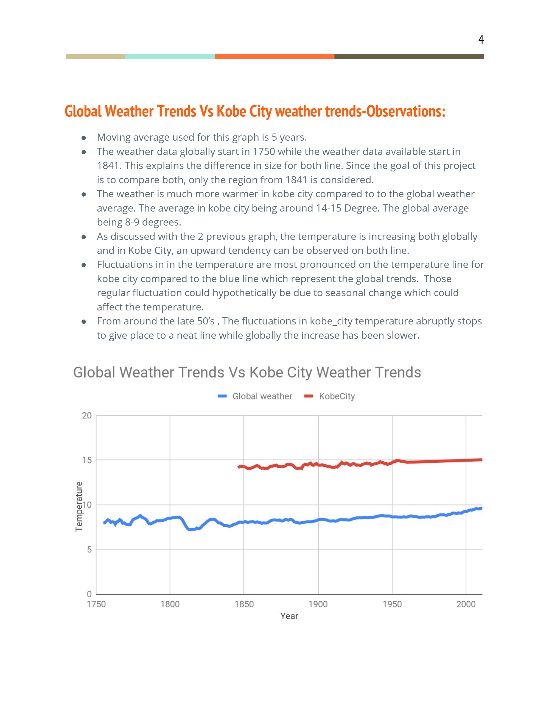

# Udacity-exploring-Weather-Trends

This is the first project in the Udacity Data Analyst Nanodegree. 
Global Weather Trends   are analyzed with google sheet. 
Kobe City in Japan Weather is compared the Global Trend

# Analysis and Visualizations

 
 
 
 # Import Documents
 
* Analysis Report: Exploring Weather Trends-Maryse .pdf
* Dataset : Weather Trends-Udacity - Global.csv

 ## References and Citations
 No particular reference was used
